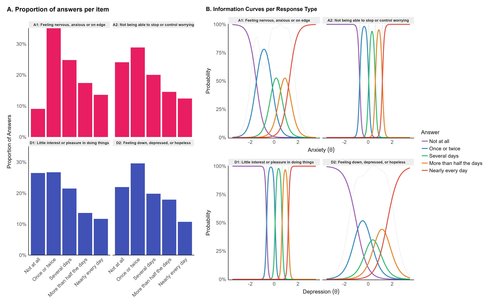
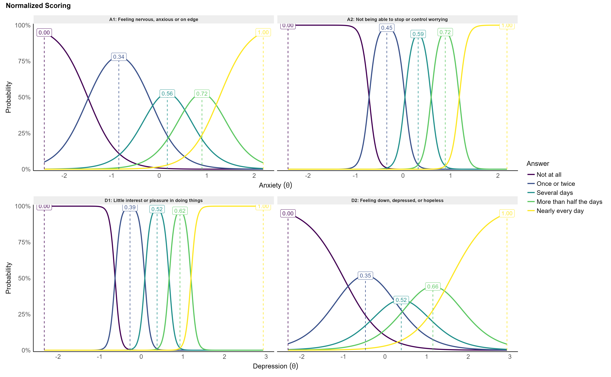

```{r, echo = FALSE, warning=FALSE, message=FALSE}
# options and parameters
options(digits = 3)

knitr::opts_chunk$set(
  collapse = TRUE,
  dpi = 450,
  fig.width = see::golden_ratio(9),
  fig.height = 9,
  fig.path = "../figures/"
)

cache <- TRUE
```

# Introduction

The Patient Health Questionnaire-4 (PHQ-4) is an ultra brief measurement of core signs of depression and anxiety [@kroenke2009ultra]. It consists of two items for depression [PHQ–2, @kroenke2003patient] and anxiety [GAD–2, @kroenke2007anxiety], each corresponding to DSM-V Diagnostic Criterion A symptoms for major depressive disorder (MDD) and generalized anxiety disorder (GAD). It has been validated across many languages and populations [@christodoulaki2022validation, @mendoza2022factor, @materu2020psychometric], becoming one of the most popular screening instruments for depression and anxiety [@maurer2018depression].

While the scale has been validated and used in the general population [@lowe20104, @hajek2020prevalence], its initial purpose was to reliably discriminate and identify potential MDD/GAD patients. This discriminative goal materializes in the scale's design and the existence of categorical cut-offs, which does not necessary entail a strong sensitivity to milder mood alterations. In particular, the gap between the two lowest possible answers, "Not at all" and "Several days", is quite large and leaves out the possibility of more subtle occurrences. While this is not necessarily an issue in clinical and diagnostic contexts, it might lead to a sub-optimal discrimination of affective levels on the lower end of the spectrum, important for instance in the context of subclinical variability quantifications. The goal of this study is hence to enhance, with minimal changes to the original scale, the sensitivity to mild mood level inflections.

# Methods

## Original Scale

The instructions *"Over the last 2 weeks, how often have you been bothered by the following problems?"* are followed with 4 items (A1 - *Feeling nervous, anxious or on edge*; A2 - *Not being able to stop or control worrying*; D1 - *Little interest or pleasure in doing things*; D2 - *Feeling down, depressed, or hopeless*). The original answer options are "Not at all" (0), "Several days" (1), "More than half the days" (2), "Nearly every day" (3). The total score is computed by summing the responses of each facet.

## Revision

In order to better capture potential mild mood inflections without altering the scale scoring or structure, we added a "Once or twice" option between "Not at all" and "Several days" [see @dobson1979equidistant for the choice of the label].

## Participants

The sample consists of 497 English-speaking participants (Mean age = 30.0, SD = 10.1, range: [18, 73]; Sex: 49.9\% females, 50.1\% males) from the general population who were administered the refined PHQ-4 online as part of another study, which data is available in open-access at https://github.com/RealityBending/IllusionGameReliability.

This study was approved by the NTU Institutional Review Board (NTU IRB-2022-187). All participants provided their informed consent prior to participation and were incentivized after completing the study.

# Results


## Descriptive

The reliability of the anxiety ($Cronbach's~\alpha = 0.903$; RMSEA = 0.031) and depression ($Cronbach's~\alpha = 0.841$; RMSEA = 0.044) subscales is excellent. The proportion of response types stratified by item (see **Figure 1A**) shows that the new "Once or twice" option was the most prevalent response for all items (on average selected in **29.12\%** of cases).


## Item Response Theory

Item Response Theory (IRT) provides insights into how well items and responses capture an underlying latent trait $\theta$. For each of the subscales, we fitted a unidimensional graded response model [GRM, @samejima1997graded]. For anxiety, the two items captured 89.2\% of the variance of the latent anxiety dimension ($\theta_{anxiety}$). The discrimination parameters suggested that the first item was less precise ($\alpha = 3.42$) than the second item ($\alpha = 12.55$) in its ability to discriminate between various levels of anxiety (i.e., each response on item 1 covers a more exclusive range of $\theta_{anxiety}$, as can be seen in **Figure 1B**). The two depression items captured 82.8\% of the variance of its latent trait ($\theta_{depression}$), and the opposite pattern was found: the first item had a higher precision ($\alpha = 16.46$) than the first ($\alpha = 2.41$). However, it is important to note that the "less precise" items were also the ones covering a larger portion of the latent space (being more sensitive on the lower end of the spectrum), offering an interesting trade-off between sensitivity and precision. Importantly, for our objective, it seems that the added "Once or twice" option does cover a selective and unique portion of the latent space.


```{r message=FALSE, warning=FALSE, fig.cap="A. Proportion of answers of each type. B. Item Information Curves from IRT showing the coverage by each item and response of the latent dimension. Typically, an optimally informative item would display a large coverage over theta, with each response presenting a narrow coverage (high discrimination between different levels).", out.width="100%"}

```

## Scoring

We propose two types of scoring procedures. The first aims at
<!-- In order to  -->
minimally disrupting the original scale and making its scores comparable, enabling comparisons across studies and the usage of developed cut-offs and norms. We suggest to score the new option, "Once or twice", as 0.5, occupying the middle space between 0 and 1 (preserving in this way the total score range of 0 - 8 per dimension).

The second scoring method we propose takes into account the non-linear spacing between responses, as indicated by the peak of their measurement information. Specifically, we found for each dimension the lower and higher values of the latent trait $\theta$ for which the probability of identification is 95\%. We considered these points as the 0 and 1 ends, and normalized the location of the peaks of each response in between.

To illustrate, a person answering "Several days" and "Once or twice" to the first and second item of the anxiety subscale would have a score of 1.5 (1 + 0.5 following the basic scoring) and a normalized score of `r insight::format_value(mean(c(0.55, 0.44)))` ($(0.55 + 0.44) / 2$).


```{r message=FALSE, warning=FALSE, fig.cap="Normalized scoring of the items taking into account the non-linear spacing between responses (based on the peak of their measurement information).", out.width="100%"}

```


```{r message=FALSE, warning=FALSE, out.width="100%"}
papaja::apa_table(
  data.frame(
    Facet = c("\\textbf{Anxiety}", "", "", "", "", "", "", "", "", "", "\\textbf{Depression}", "", "", "", "", "", "", "", "", ""),
    Item = c("Feeling nervous, anxious or on edge", "", "", "", "", "Not being able to stop or control worrying", "", "", "", "", "Little interest or pleasure in doing things", "", "", "", "", "Feeling down, depressed, or hopeless", "", "", "", ""),
    Response = paste0("\\textit{", rep(c("Not at all", "Once or twice", "Several days", "More than half the days", "Nearly every day"), 4), "}"),
    Basic_Scoring = rep(c("0", "0.5", "1", "2", "3"), 4),
    Normalized_Scoring = c("0", "0.34", "0.55", "0.71", "1",
                           "0", "0.44", "0.58", "0.71", "1",
                           "0", "0.38", "0.51", "0.62", "1",
                           "0", "0.35", "0.52", "0.66", "1")
    ),
  caption = "Refined Patient Health Questionnaire-4 (PHQ-4R). The instructions are \"Over the last 2 weeks, how often have you been bothered by the following problems?\". The 0.5 scoring is introduced to preserve the compatibility with the original version, and enables to use its norms and cut-offs. The normalized scoring takes into account the non-linear spacing between item responses.",  
  escape = FALSE,
  font_size = "scriptsize",
  col.names = c("Facet", "Item", "Response", 
                "Basic Scoring", 
                "Normalized Scoring"),
  midrules = c(5, 10, 15))
```

# Discussion

The objective of this study was to test the introduction of a "Once or twice" response option to the PHQ-4 to enhance its sensitivity to milder mood fluctuations. The fact that this new response option was the most prevalent response made by participants in our study is in itself evidence for its usefulness. IRT analysis further revealed that this response captures with precision a unique portion of anxiety and depression. Taken together, our results suggest that adding this option response increases the scale's potential to discriminate average mood levels (which are superior to zero) from lower-end extremes (the true zero). Future studies should further corroborate our statistical validation and test the usefulness of this revision on more targeted samples (e.g., clinical populations) and by cross-validating it with other more comprehensive measures.


# Data Availability

The dataset analysed during the current study are available in the GitHub repository https://github.com/DominiqueMakowski/PHQ4R


# Funding

This work was supported by the Presidential Postdoctoral Fellowship Grant (NTU-PPF-2020-10014) from Nanyang Technological University (awarded to DM).


\newpage

# References

::: {#refs custom-style="Bibliography"}
:::
