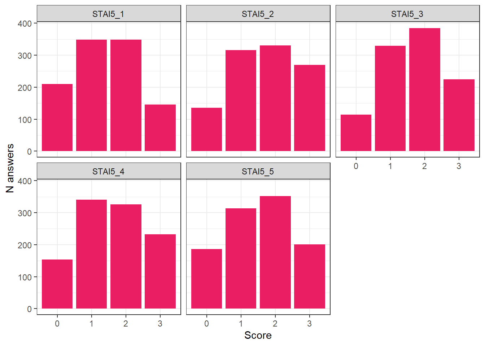

## Data Preparation


::: {.cell}

```{.r .cell-code}
library(tidyverse)
library(easystats)
library(patchwork)
library(ggside)
```
:::

::: {.cell}

```{.r .cell-code}
df <- read.csv("../data/data_raw.csv")
```
:::


The initial sample consisted of 29 participants (Mean age = 25.1, SD = 7.8, range: [17, 51]; Gender: 69.0% women, 24.1% men, 0.00% non-binary, 6.90% missing; Education: Bachelor, 48.28%; Doctorate, 3.45%; High school, 41.38%; Master, 6.90%).

### Compute Scores

#### PHQ-4


::: {.cell}

```{.r .cell-code}
recode_phq <- function(x) {
  case_when(
    x == 1 ~ 0.5,
    x == 2 ~ 1,
    x == 3 ~ 2,
    x == 4 ~ 3,
    .default = x
  )
}

df <- df |>
  mutate(
    PHQ4_Anxiety_1 = ifelse(PHQ4_Condition == "PHQ4 - Revised", recode_phq(PHQ4_Anxiety_1), PHQ4_Anxiety_1),
    PHQ4_Anxiety_2 = ifelse(PHQ4_Condition == "PHQ4 - Revised", recode_phq(PHQ4_Anxiety_2), PHQ4_Anxiety_2),
    PHQ4_Depression_3 = ifelse(PHQ4_Condition == "PHQ4 - Revised", recode_phq(PHQ4_Depression_3), PHQ4_Depression_3),
    PHQ4_Depression_4 = ifelse(PHQ4_Condition == "PHQ4 - Revised", recode_phq(PHQ4_Depression_4), PHQ4_Depression_4),
    PHQ4_Anxiety = PHQ4_Anxiety_1 + PHQ4_Anxiety_2,
    PHQ4_Depression = PHQ4_Depression_3 + PHQ4_Depression_4,
    PHQ4_Total = PHQ4_Anxiety + PHQ4_Depression
  )
```
:::

::: {.cell}

```{.r .cell-code}
df |>
  select(matches("PHQ4_")) |>
  pivot_longer(cols = matches("Depression_|Anxiety_"), names_to = "item", values_to = "score") |>
  ggplot(aes(x = as.factor(score))) +
  geom_bar(stat="count") +
  facet_grid(item ~ PHQ4_Condition) +
  labs(x = "Score", y = "N answers")
```

::: {.cell-output-display}
{width=672}
:::
:::


#### STAI-5


::: {.cell}

```{.r .cell-code}
df |>
  select(matches("STAI5_"), -STAI5_Duration, -STAI5_Order) |>
  pivot_longer(cols = matches("STAI5_"), names_to = "item", values_to = "score") |>
  ggplot(aes(x = as.factor(score))) +
  geom_bar(stat="count") +
  facet_wrap(~item) +
  labs(x = "Score", y = "N answers")
```

::: {.cell-output-display}
{width=672}
:::
:::

::: {.cell}

```{.r .cell-code}
df <- df |> 
  mutate(STAI5_General = (STAI5_1 + STAI5_2 + STAI5_3 + STAI5_4 + STAI5_5) / 5)
```
:::


#### BDI-2


::: {.cell}

```{.r .cell-code}
df |>
  select(matches("BDI2_"), -BDI2_Duration, -BDI2_Order) |>
  pivot_longer(cols = matches("BDI2_"), names_to = "item", values_to = "score") |>
  ggplot(aes(x = as.factor(score))) +
  geom_bar(stat="count") +
  facet_wrap(~item) +
  labs(x = "Score", y = "N answers")
```

::: {.cell-output-display}
{width=672}
:::
:::

::: {.cell}

```{.r .cell-code}
df <- df |> 
  mutate(BDI2_Total = rowSums(select(df, matches("BDI2_"), -BDI2_Duration, -BDI2_Order)))
```
:::


### Recruitment History


::: {.cell}

```{.r .cell-code}
# Consecutive count of participants per day (as area)
df |>
  mutate(
    Date = as.Date(Date, format = "%d/%m/%Y"),
    N = 1:nrow(df)
  ) |>
  ggplot(aes(x = Date, y = N)) +
  geom_area() +
  scale_y_continuous(expand = c(0, 0)) +
  labs(
    title = "Recruitment History",
    x = "Date",
    y = "Total Number of Participants"
  ) +
  see::theme_modern()
```

::: {.cell-output-display}
{width=672}
:::
:::


## Outliers

### Experiment Duration


::: {.cell}

```{.r .cell-code}
df |>
  mutate(Participant = fct_reorder(Participant, Experiment_Duration),
         Category = ifelse(Experiment_Duration > 50, "extra", "ok"),
         Duration = ifelse(Experiment_Duration > 50, 50, Experiment_Duration)) |>
  ggplot(aes(y = Participant, x = Duration)) +
  geom_point(aes(color = Category, shape = Category)) +
  scale_shape_manual(values = c("extra" = 3, ok = 19)) +
  scale_color_manual(values = c("extra" = "red", ok = "black")) +
  guides(color = "none", shape = "none") +
  ggside::geom_xsidedensity(fill = "grey", color=NA) +
  ggside::scale_xsidey_continuous(expand = c(0, 0)) +
  labs(
    title = "Experiment Completion Time",
    x = "Duration (in minutes)",
    y = "Participant"
  )  +
  see::theme_modern() +
  ggside::theme_ggside_void() +
  theme(ggside.panel.scale = .3) 
```

::: {.cell-output-display}
{width=672}
:::
:::


## Descriptive Statistics

### Participants

The final sample includes 29 participants (Mean age = 25.1, SD = 7.8, range: [17, 51]; Gender: 69.0% women, 24.1% men, 0.00% non-binary, 6.90% missing; Education: Bachelor, 48.28%; Doctorate, 3.45%; High school, 41.38%; Master, 6.90%).

### Table 1


::: {.cell}

```{.r .cell-code}
table1 <- df |> 
  select(Age, 
         PHQ4_Condition, 
         STAI5 = STAI5_General,
         BDI2 = BDI2_Total) |> 
  report::report_sample(group_by = "PHQ4_Condition")

table1$Variable <- str_remove_all(table1$Variable, fixed("Mean "))
table1$Variable <- str_remove_all(table1$Variable, fixed(" (SD)"))

insight::display(table1)
```

::: {.cell-output-display}
Table: Descriptive Statistics

|Variable | PHQ4 - Original (n=14)| PHQ4 - Revised (n=15)|  Total (n=29)|
|:--------|----------------------:|---------------------:|-------------:|
|Age      |           24.57 (6.33)|          25.53 (9.19)|  25.07 (7.81)|
|STAI5    |            1.54 (0.81)|           1.80 (0.64)|   1.68 (0.73)|
|BDI2     |          18.79 (13.12)|         18.60 (10.20)| 18.69 (11.49)|
:::
:::

::: {.cell}

```{.r .cell-code}
rbind(
  as.data.frame(report::report(t.test(df$Age ~ df$PHQ4_Condition))),
  as.data.frame(report::report(t.test(df$STAI5_General ~ df$PHQ4_Condition))),
  as.data.frame(report::report(t.test(df$BDI2_Total ~ df$PHQ4_Condition)))
) |> 
  select(Parameter, t, df_error, p) |> 
  mutate(Parameter = str_remove_all(Parameter, fixed("df$"))) |>
  insight::display()
```

::: {.cell-output-display}
|Parameter     |     t |    df |     p |
|:-------------|:-----:|:-----:|:-----:|
|Age           | -0.33 | 24.93 | 0.744 |
|STAI5_General | -0.94 | 24.80 | 0.354 |
|BDI2_Total    |  0.04 | 24.55 | 0.967 |
:::
:::


### Distributions


::: {.cell}

```{.r .cell-code}
df |> 
  select(PHQ4_Condition, 
         STAI5 = STAI5_General,
         BDI2 = BDI2_Total,
         PHQ4_Total) |> 
  standardize() |> 
  estimate_density(at = "PHQ4_Condition") |> 
  ggplot(aes(x=x, y=y)) +
  geom_line(aes(color = Parameter)) +
  labs(x = "Standardized Score", y = "Distribution") +
  facet_wrap(~PHQ4_Condition)
```

::: {.cell-output-display}
{width=672}
:::
:::


## Save 


::: {.cell}

```{.r .cell-code  code-fold="false"}
write.csv(df, "../data/data.csv", row.names = FALSE)
```
:::

